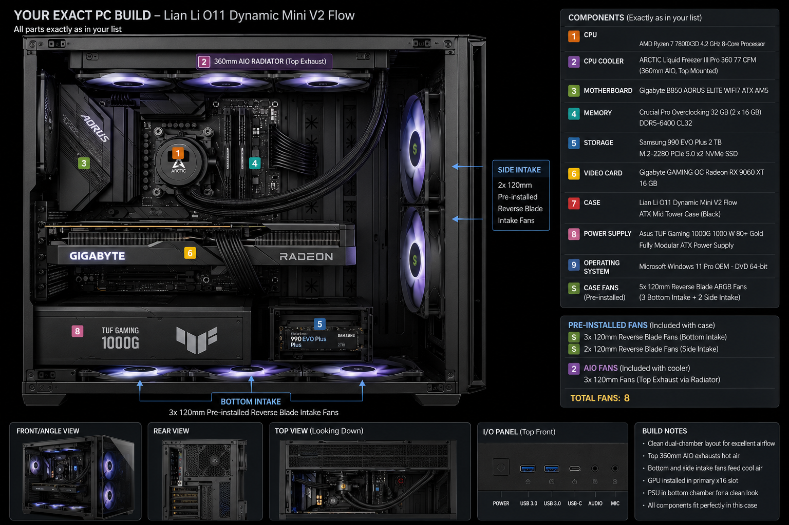

# Components

Status: Published HTML content. Last reviewed: 2026-07-13 13:53 BST.

## Introduction

This chapter identifies the hardware used in the build and explains the role of each component before installation begins.

Use this chapter with the [Bill of Materials](appendix/bill-of-materials.md), which contains exact model numbers, manufacturer references, Amazon UK links, and accepted RAM or SSD alternatives.

## Visual Reference

Use these images to identify the real component families before opening packaging. Product photography can change on manufacturer websites, so match model numbers against the [Bill of Materials](appendix/bill-of-materials.md) before purchase or installation.

  <figure>
    
    <figcaption><strong>CPU:</strong> AMD Ryzen 7 7800X3D. Source: <a href="https://www.amd.com/en/products/processors/desktops/ryzen/7000-series/amd-ryzen-7-7800x3d.html">AMD</a>.</figcaption>
  </figure>
  <figure>
    
    <figcaption><strong>CPU cooler:</strong> ARCTIC Liquid Freezer III Pro 360. Source: <a href="https://www.arctic.de/en/Liquid-Freezer-III-Pro-360/ACFRE00180A">ARCTIC</a>.</figcaption>
  </figure>
  <figure>
    
    <figcaption><strong>Motherboard:</strong> Gigabyte B850 AORUS Elite WiFi7. Source: <a href="https://www.gigabyte.com/Motherboard/B850-AORUS-ELITE-WIFI7-rev-1x">Gigabyte</a>.</figcaption>
  </figure>
  <figure>
    
    <figcaption><strong>Memory:</strong> G.SKILL Flare X5 DDR5-6000 CL30 32GB kit. Source: <a href="https://www.gskill.com/product/165/396/1673491242/F5-6000J3038F16GX2-FX5">G.SKILL</a>.</figcaption>
  </figure>
  <figure>
    
    <figcaption><strong>SSD:</strong> Samsung 990 EVO Plus 2TB NVMe. Source: <a href="https://www.samsung.com/au/memory-storage/nvme-ssd/990-evo-plus-2tb-nvme-pcie-gen-4-mz-v9s2t0bw/">Samsung</a>.</figcaption>
  </figure>
  <figure>
    
    <figcaption><strong>GPU:</strong> Gigabyte Radeon RX 9060 XT Gaming OC 16GB. Source: <a href="https://www.gigabyte.com/Graphics-Card/GV-R9060XTGAMING-OC-16GD">Gigabyte</a>.</figcaption>
  </figure>
  <figure>
    
    <figcaption><strong>Case:</strong> Lian Li O11 Dynamic Mini V2 Flow. Source: <a href="https://lian-li.com/product/o11-dynamic-mini-v2/">Lian Li</a>.</figcaption>
  </figure>
  <figure>
    
    <figcaption><strong>Power supply:</strong> ASUS TUF Gaming 1000W Gold. Source: <a href="https://www.asus.com/us/motherboards-components/power-supply-units/tuf-gaming/tuf-gaming-1000g/">ASUS</a>.</figcaption>
  </figure>

## Purpose

Confirm that every major component is present, compatible, and suitable for the planned gaming PC build.

## Estimated Time

20-30 minutes.

## Difficulty

Beginner.

## Required Tools

- Printed or digital copy of the bill of materials.
- Component boxes and invoices.
- Phone or laptop for checking manufacturer pages.
- Clean table or work surface.

## Warnings

- Do not open anti-static bags until the build workspace is ready.
- Do not install parts before confirming the exact model numbers.
- Do not substitute RAM or SSD models unless they meet the requirements in the bill of materials.
- Do not rely only on retailer titles. Check manufacturer model numbers.

## Step-by-Step Instructions

1. Lay out the component boxes on a clean surface.
2. Confirm the CPU is the AMD Ryzen 7 7800X3D.
3. Confirm the CPU cooler is the ARCTIC Liquid Freezer III Pro 360.
4. Confirm the motherboard is the Gigabyte B850 AORUS Elite WiFi7.
5. Confirm the memory is a matched 32GB DDR5 kit, preferably 2 x 16GB DDR5-6000 CL30 with AMD EXPO.
6. Confirm the SSD is a 2TB M.2 2280 NVMe drive.
7. Confirm the GPU is the Gigabyte Radeon RX 9060 XT Gaming OC 16GB.
8. Confirm the case is the Lian Li O11 Dynamic Mini V2 Flow.
9. Confirm the PSU is the ASUS TUF Gaming 1000W Gold.
10. Confirm the Windows 11 Pro USB installer is available.
11. Check the compatibility summary in the bill of materials before opening packaging.

## Component Roles

| Component | Role in the build |
| --- | --- |
| CPU | Handles game logic, system tasks, background applications, and general compute work. |
| CPU cooler | Removes CPU heat and helps maintain sustained boost behavior. |
| Motherboard | Connects the CPU, memory, SSD, GPU, fans, front panel, USB, audio, networking, and power delivery. |
| Memory | Provides fast temporary working space for Windows, games, launchers, and background applications. |
| SSD | Stores Windows, applications, games, drivers, benchmark tools, and user files. |
| GPU | Renders games and drives the display outputs. |
| Case | Holds the system, controls physical layout, supports airflow, and manages cable routing. |
| PSU | Converts wall power into stable DC power for the motherboard, CPU, GPU, storage, and accessories. |
| Operating system | Provides the Windows environment used for drivers, games, benchmarks, updates, and maintenance. |

## Verification Checklist

- [ ] CPU model matches AMD Ryzen 7 7800X3D.
- [ ] Motherboard socket is AM5.
- [ ] Memory is DDR5, not DDR4.
- [ ] Memory is a matched kit.
- [ ] SSD is M.2 2280 NVMe.
- [ ] GPU is the 16GB model.
- [ ] PSU is 1000W and fully modular.
- [ ] Case is the O11 Dynamic Mini V2 Flow, not the older O11 Dynamic Mini.
- [ ] Windows 11 Pro USB installer is available.
- [ ] No component has visible shipping damage.

## Common Mistakes

- Buying the 8GB GPU variant instead of the 16GB model.
- Buying DDR4 memory for a DDR5-only motherboard.
- Buying a SATA M.2 SSD instead of an NVMe SSD.
- Buying the older O11 Dynamic Mini instead of the O11 Dynamic Mini V2 Flow.
- Assuming every Amazon listing title is correct without checking model numbers.
- Mixing separate memory kits to reach 32GB.

## Expected Result

All components are identified, visually inspected, and confirmed against the bill of materials before installation begins.

## Next Chapter

Continue to [Motherboard Overview](03-motherboard-overview.md).
