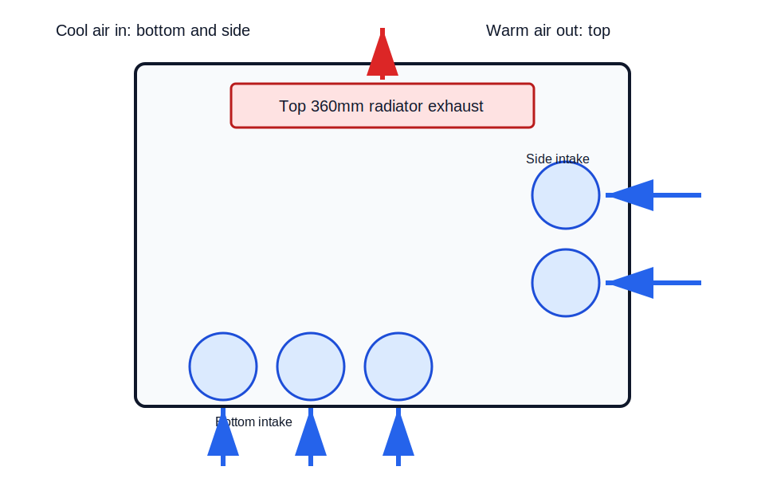
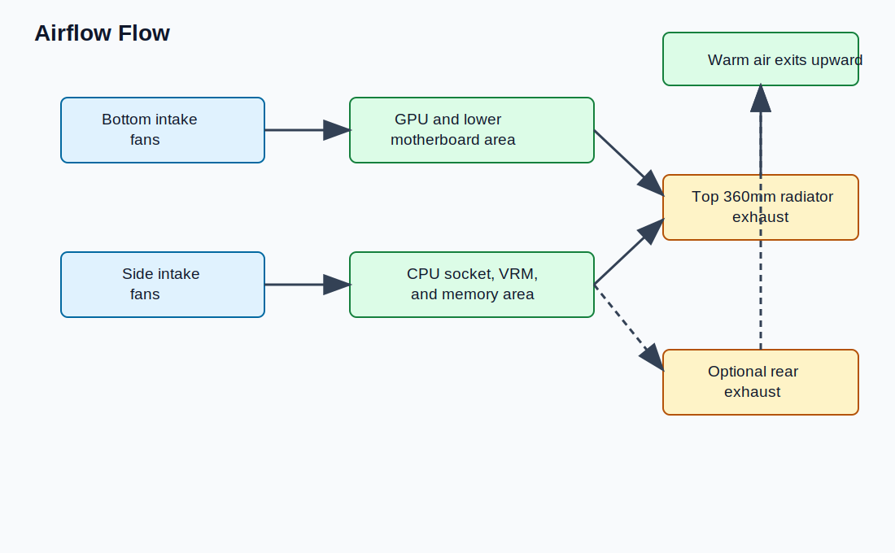
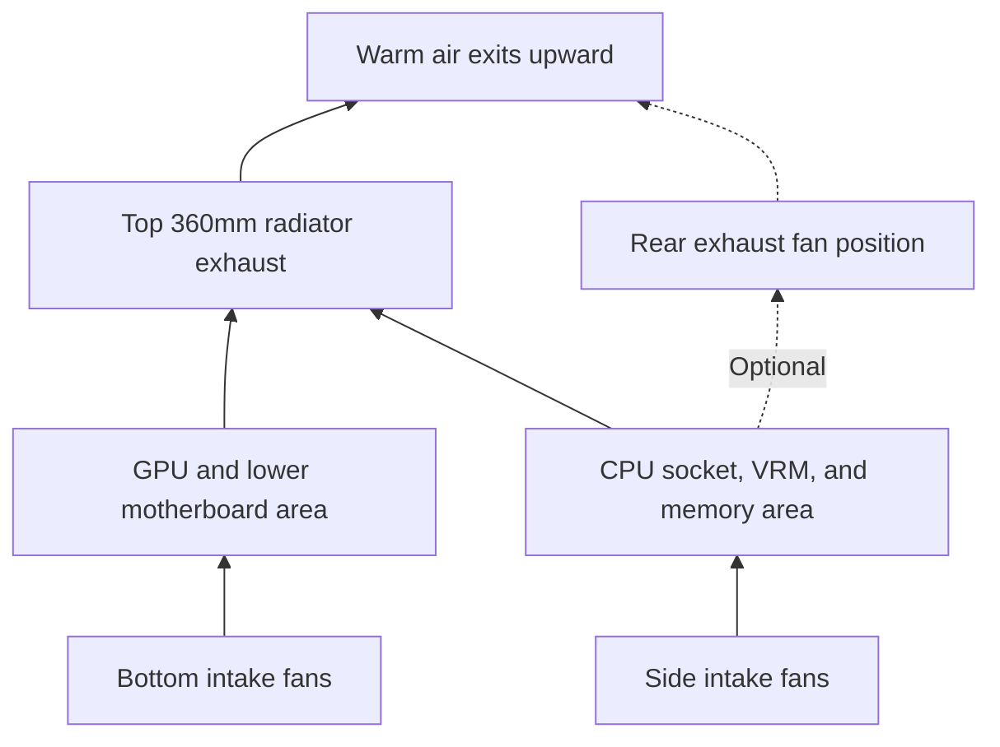

# Case Overview

Status: Initial Milestone 2 content. Last verified: 2026-07-13 10:53 BST.

## Introduction

This chapter introduces the Lian Li O11 Dynamic Mini V2 Flow before installation begins.

The case is a compact dual-chamber chassis with tempered-glass front and side panels, a separate rear chamber for the PSU and cable management, and a Flow configuration that includes five reverse-blade 120mm PWM fans.

## Purpose

Confirm the case layout, airflow design, fan positions, radiator support, clearance limits, and cable-routing areas before installing hardware.

## Estimated Time

20-30 minutes.

## Difficulty

Beginner.

## Required Tools

- Lian Li O11 Dynamic Mini V2 Flow case.
- Case accessory box.
- Phillips #2 screwdriver.
- Small container for screws.
- Microfibre cloth for glass panels.
- Case manual or product page.

## Warnings

- Remove tempered-glass panels carefully and place them on a soft, stable surface.
- Do not build with glass panels balanced upright against a wall or desk.
- Do not overtighten panel screws, motherboard screws, fan screws, or radiator screws.
- Keep case screws separated by type.
- Confirm fan cable paths before installing the motherboard, because access becomes tighter later.
- Treat the top 360mm AIO fit as compatible but clearance-sensitive because the ARCTIC radiator is 38mm thick and requires at least 63mm total installation clearance with fans.

## Step-by-Step Instructions

Diagram source: [airflow.mmd](assets/diagrams/mermaid/airflow.mmd)

1. Place the case on a stable work surface.
2. Remove the glass side panel and front glass panel.
3. Remove the rear steel panel.
4. Locate the main chamber, rear cable chamber, PSU chamber, fan brackets, and drive cages.
5. Confirm the five pre-installed Flow fans are present: three bottom intake fans and two side intake fans.
6. Locate the top fan and radiator bracket.
7. Locate the front I/O module and decide whether it will remain at the bottom or move to the top.
8. Locate the ATX PSU mounting area in the rear chamber.
9. Locate the cable-routing paths for the 24-pin motherboard cable, CPU EPS cables, PCIe GPU cable, USB headers, front audio, and front-panel wiring.
10. Locate the horizontal and vertical GPU support hardware.
11. Confirm the case accessories are present before installing hardware.

## Case Identity

| Item | Detail |
| --- | --- |
| Model | Lian Li O11 Dynamic Mini V2 Flow |
| Black Flow SKU | `O11DMIV2FX` |
| Chassis volume | 45.38L |
| Motherboard support | ATX, Micro-ATX, Mini-ITX, and ATX back-connect |
| GPU length clearance | 400mm |
| CPU air-cooler height clearance | 160mm |
| PSU support | ATX PSU under 200mm |
| Top radiator support | 240mm, 280mm, or 360mm |
| Side radiator support | 240mm |
| Maximum 120mm fan support | 9 x 120mm |
| Included Flow fans | 2 x side reverse-blade 120mm PWM, 3 x bottom reverse-blade 120mm PWM |
| Front I/O | 2 x USB 3.0, 1 x USB 3.2 Type-C, 1 x audio, 1 x power button |

## Layout

| Area | Purpose |
| --- | --- |
| Main chamber | Holds the motherboard, GPU, AIO pump/block, top radiator, visible fan layout, and visible cable exits. |
| Rear chamber | Holds the PSU, excess cable length, drive cages, and cable tie-down points. |
| Bottom fan area | Provides direct GPU intake airflow through the slanted bottom design. |
| Side fan area | Provides additional intake airflow beside the motherboard tray. |
| Top bracket | Holds the 360mm AIO radiator and fans for this build. |
| Rear panel area | Provides access to cable routing and PSU installation. |

## Compatibility Evidence

| Build item | Required size or support | Case support | Result |
| --- | --- | --- | --- |
| Motherboard | Gigabyte B850 AORUS Elite WiFi7 is ATX | O11 Dynamic Mini V2 supports ATX | Pass |
| GPU | Gigabyte RX 9060 XT Gaming OC 16GB is 281mm long | Case supports 400mm GPUs | Pass, with 119mm spare length clearance |
| PSU | ASUS TUF Gaming 1000W Gold is 150mm long | Case supports ATX PSUs under 200mm | Pass, with 50mm spare PSU length clearance |
| AIO radiator | ARCTIC Liquid Freezer III Pro 360 uses a 360mm radiator | Case supports top 360mm radiator | Pass, but clearance-sensitive |
| AIO thickness | ARCTIC radiator is 38mm; with standard 25mm fans the assembly is about 63mm | ARCTIC requires at least 63mm case clearance | Conditional pass; use the top bracket and confirm clearance before final wiring |
| Front USB-C | Case has USB 3.2 Type-C front I/O | Motherboard has `FU3C_20G` front USB-C header | Pass |
| Front USB-A | Case has 2 x USB 3.0 | Motherboard has `FU3A_5G` front USB 3.2 Gen 1 header | Pass |
| Front audio | Case has front audio | Motherboard has `F_AUDIO` | Pass |

## Radiator and Fan Plan

Use the ARCTIC Liquid Freezer III Pro 360 in the top radiator position.

Recommended airflow for this build:

| Position | Fan direction | Reason |
| --- | --- | --- |
| Bottom, included 3 x 120mm reverse-blade fans | Intake | Feeds the GPU directly. |
| Side, included 2 x 120mm reverse-blade fans | Intake | Adds fresh air to the main chamber. |
| Top, 360mm AIO fans | Exhaust | Removes CPU heat through the radiator. |
| Rear, optional 120mm fan | Exhaust if added later | Helps remove warm air near the rear I/O area. |

This creates a simple bottom/side intake and top exhaust layout. The exact fan curve is configured later in BIOS.

## AIO Fit Decision

The ARCTIC cooler is not a normal thin 360mm AIO. Its radiator is 38mm thick, and ARCTIC states that the Liquid Freezer III Pro requires at least 63mm of clearance for installation. With the included radiator fans, treat the top mount as a tight but acceptable target.

Build decision:

- Use the top radiator bracket.
- Install the radiator and fans on the removable bracket before final motherboard cabling.
- Route CPU EPS cables before the radiator is fully fixed if access is tight.
- Do not add top-mounted RGB/fan accessories that reduce radiator clearance.
- Re-check cable strain at the top-left CPU power connectors before closing the case.

## Front I/O Decision

Use the front I/O in the most convenient location for the desk layout.

For a desk-side tower, top I/O is usually easier to reach. For a case placed on top of a desk with the lower edge accessible, bottom I/O can keep cables visually cleaner.

The motherboard supports the required case I/O:

- USB-C cable to `FU3C_20G`.
- USB-A cable to `FU3A_5G`.
- Audio cable to `F_AUDIO`.
- Power switch cable to `F_PANEL`.

## Verification Checklist

- [ ] Case model is O11 Dynamic Mini V2 Flow.
- [ ] SKU is `O11DMIV2FX` for the black Flow version.
- [ ] Five reverse-blade fans are present.
- [ ] Top radiator bracket is present and removable.
- [ ] Accessory box is present.
- [ ] ATX motherboard standoff pattern is identified.
- [ ] PSU chamber is clear.
- [ ] Front I/O cable paths are identified.
- [ ] Bottom and side fans are planned as intake.
- [ ] Top AIO fans are planned as exhaust.
- [ ] ARCTIC 63mm AIO clearance requirement is understood before installation.

## Common Mistakes

- Installing the motherboard before routing CPU EPS cables.
- Forgetting that the Flow version already includes five fans.
- Treating the ARCTIC radiator like a thin 27mm radiator.
- Installing the radiator before checking top-left motherboard cable access.
- Leaving the front I/O module in an inconvenient position for the final desk layout.
- Scratching glass panels by placing them on a hard surface.
- Over-tightening glass or bracket screws.
- Confusing reverse-blade intake fans with standard exhaust orientation.

## Expected Result

The case is open, inspected, and understood. The fan direction, radiator position, PSU fit, GPU fit, front I/O routing, and clearance-sensitive AIO plan are confirmed before build preparation begins.

## Sources Reviewed

- [Lian Li O11 Dynamic Mini V2 product page](https://lian-li.com/product/o11-dynamic-mini-v2/)
- [Lian Li O11 Dynamic Mini V2 manual mirror](https://www.manua.ls/lian-li/o11-dynamic-mini-v2/manual)
- [ARCTIC Liquid Freezer III Pro 360](https://www.arctic.de/en/Liquid-Freezer-III-Pro-360/ACFRE00180A)
- [Gigabyte Radeon RX 9060 XT Gaming OC 16G specifications](https://www.gigabyte.com/Graphics-Card/GV-R9060XTGAMING-OC-16GD/sp)
- [ASUS TUF Gaming 1000W Gold tech specs](https://www.asus.com/us/motherboards-components/power-supply-units/tuf-gaming/tuf-gaming-1000g/techspec/)

## Next Chapter

Continue to [Tools](05-tools.md).
