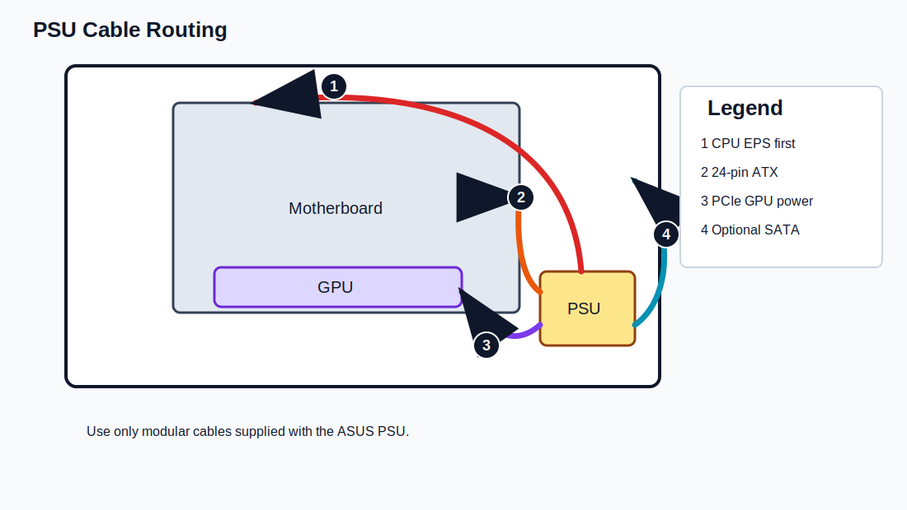
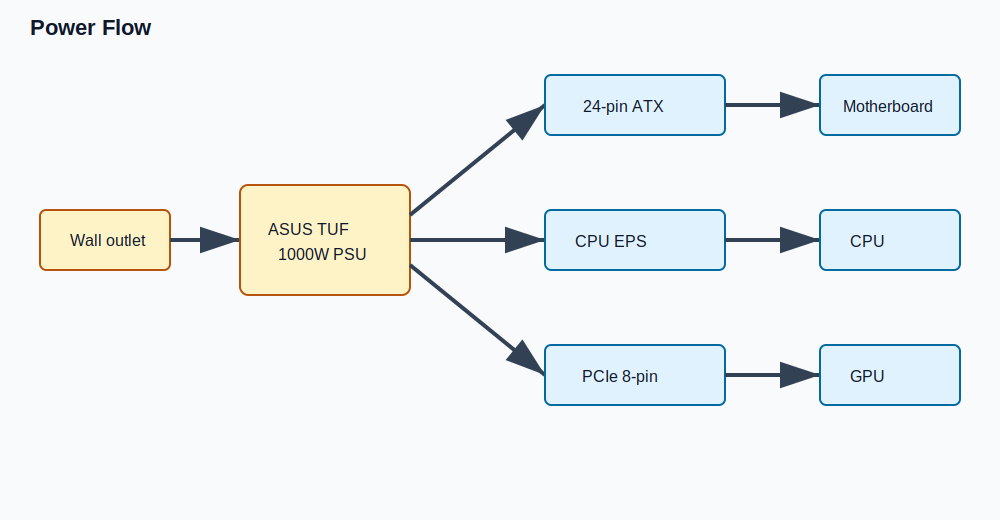

# PSU Installation

Status: Published HTML content. Last reviewed: 2026-07-13 13:53 BST.

## Introduction

This chapter installs the ASUS TUF Gaming 1000W Gold power supply and prepares the required modular cables.

## Purpose

Mount the PSU securely and route the main power cables before the motherboard, radiator, and graphics card restrict access.

## Estimated Time

20-35 minutes.

## Difficulty

Beginner.

## Required Tools

- Phillips #2 screwdriver.
- ASUS PSU modular cables.
- Case PSU screws.
- Cable ties or hook-and-loop straps.

## Warnings

- Keep the PSU switch off until first power-on checks.
- Use only the modular cables supplied with this PSU.
- Do not reuse modular PSU cables from another power supply.
- Do not plug the PSU into wall power while routing cables.
- Do not sharply bend cables at the connector body.

## Step-by-Step Instructions

PlantUML source: [power-flow.puml](assets/diagrams/plantuml/power-flow.puml)

1. Confirm the PSU is the ASUS TUF Gaming 1000W Gold.
2. Confirm the PSU is unplugged and switched off.
3. Connect the required modular cables before mounting if access is easier:
    - 24-pin ATX motherboard cable.
    - CPU EPS 8-pin cable, plus any additional CPU power cable required by the motherboard layout.
    - PCIe 8-pin cable for the graphics card.
    - SATA power cable if any future accessory, hub, or controller requires it.
4. Slide the PSU into the PSU chamber with the fan facing the correct ventilated side for the case layout.
5. Align the PSU screw holes with the rear bracket.
6. Secure the PSU using the supplied screws.
7. Route the 24-pin cable toward the motherboard right edge.
8. Route CPU EPS power to the top-left motherboard area before radiator installation.
9. Route the PCIe GPU power cable toward the expansion slot area.
10. Coil unused modular cables outside the case and store them with the PSU box.

## Verification Checklist

- [ ] PSU is mounted with four screws.
- [ ] PSU switch is off.
- [ ] Only ASUS-supplied modular cables are used.
- [ ] 24-pin ATX cable reaches the motherboard right edge.
- [ ] CPU EPS cable reaches the motherboard top-left.
- [ ] PCIe 8-pin cable reaches the GPU area.
- [ ] Unused modular cables are not hidden loose inside the case.

## Common Mistakes

- Reusing cables from a different modular PSU.
- Forgetting the CPU EPS cable until after the radiator is installed.
- Routing GPU power through a path that blocks airflow.
- Leaving unused cables in the PSU chamber.
- Mounting the PSU before connecting modular cables in a tight layout.

## Expected Result

The PSU is installed, switched off, and ready to power the motherboard, CPU, and GPU.

## Next Chapter

Continue to [Motherboard Installation](12-motherboard-installation.md).
