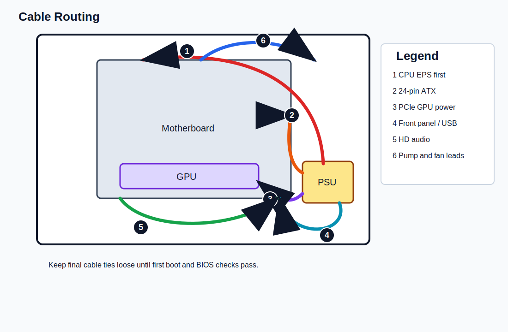

# Cable Routing

Status: Initial Milestone 2 content. Last verified: 2026-07-13 10:53 BST.

## Introduction

This chapter routes and secures power, front-panel, USB, audio, fan, pump, and PCIe cables inside the Lian Li O11 Dynamic Mini V2 Flow.

## Purpose

Keep airflow clear, reduce side-panel pressure, prevent fan contact, and make later troubleshooting easier.

## Estimated Time

30-60 minutes.

## Difficulty

Moderate.

## Required Tools

- Cable ties or hook-and-loop straps.
- Side cutters.
- Flashlight.
- Motherboard and case manuals.

## Warnings

- Do not over-tighten cable ties.
- Do not route cables through fan blades.
- Do not sharply bend the GPU power cable at the connector.
- Do not close side panels until first boot is successful.
- Do not hide disconnected cables where they cannot be inspected.

## Step-by-Step Instructions

1. Route the 24-pin ATX cable through the nearest grommet to the motherboard right edge.
2. Route CPU EPS cables along the rear/top channel and into the motherboard top-left corner.
3. Route the PCIe 8-pin cable to the GPU with a gentle curve.
4. Route the front-panel power switch cable to the motherboard front-panel header area.
5. Route USB 3.x and USB-C cables to the board edge without twisting the connectors.
6. Route HD audio to the bottom-left motherboard header.
7. Route fan and pump cables toward their headers or fan hub path.
8. Bundle excess cable length behind the motherboard tray.
9. Use reusable straps for thick cable bundles.
10. Use small cable ties only after confirming that the system boots.
11. Keep the rear side panel off until Windows and drivers are installed.

## Verification Checklist

- [ ] 24-pin cable is fully seated and not under strain.
- [ ] CPU EPS cable is fully seated and clear of the radiator fans.
- [ ] GPU power cable is fully seated with a gentle bend.
- [ ] Fan blades are clear.
- [ ] Cables do not block bottom or side intake fans.
- [ ] Rear cable bundle does not prevent the side panel from closing.
- [ ] Cables remain traceable for troubleshooting.

## Common Mistakes

- Making final cable ties before first boot.
- Pulling front-panel cables tight.
- Routing HD audio across visible airflow paths.
- Leaving the rear panel bulging.
- Hiding unused modular cables inside the case.

## Expected Result

Cables are connected, routed cleanly, and temporarily secured while still allowing inspection before first boot.

## Next Chapter

Continue to [Front Panel Connectors](16-front-panel-connectors.md).
