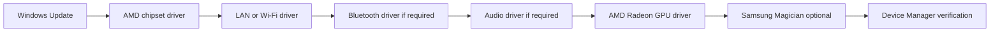

# Driver Installation

Status: Initial Milestone 2 content. Last verified: 2026-07-13.

## Introduction

This chapter installs platform, networking, audio, and graphics drivers after Windows 11 Pro is installed.

## Purpose

Bring the system from a basic Windows installation to a fully supported hardware configuration using official driver sources.

## Estimated Time

45-90 minutes.

## Difficulty

Beginner to moderate.

## Required Tools

- Internet connection.
- Windows administrator account.
- Browser.
- USB drive if downloading drivers from another machine.

## Warnings

- Use official AMD, Gigabyte, Microsoft, and GPU vendor driver sources.
- Avoid third-party driver updater utilities.
- Restart when installers request it.
- Install chipset drivers before GPU tuning or benchmark work.
- Keep a note of driver versions in the [Drivers Appendix](appendix/drivers.md).

## Step-by-Step Instructions

Diagram source: [driver-order.mmd](assets/diagrams/mermaid/driver-order.mmd)

1. Run Windows Update until no critical updates remain.
2. Install the AMD chipset driver for the B850/AM5 platform from Gigabyte or AMD.
3. Restart Windows.
4. Install LAN and Wi-Fi/Bluetooth drivers from the motherboard support page if Windows did not install working versions.
5. Restart Windows if prompted.
6. Install Realtek or motherboard audio drivers if required.
7. Install AMD Radeon graphics drivers for the Gigabyte Radeon RX 9060 XT.
8. Restart Windows.
9. Open Device Manager and confirm there are no unknown devices.
10. Record the installed driver sources and versions in the drivers appendix.

## Recommended Driver Order

1. Windows Update.
2. AMD chipset driver.
3. LAN or Wi-Fi driver.
4. Bluetooth driver.
5. Audio driver.
6. AMD Radeon GPU driver.
7. Optional utilities only if they provide a required function.

## Verification Checklist

- [ ] Windows Update is current.
- [ ] AMD chipset driver is installed.
- [ ] Network connectivity works.
- [ ] Bluetooth works if needed.
- [ ] Audio output works.
- [ ] AMD Radeon driver is installed.
- [ ] Device Manager has no unknown devices.
- [ ] Driver versions are recorded.

## Common Mistakes

- Installing GPU drivers before chipset drivers and Windows Update.
- Using third-party driver bundles.
- Ignoring failed device entries in Device Manager.
- Installing every motherboard utility without a reason.
- Forgetting to restart between driver layers.

## Expected Result

Windows has working chipset, network, audio, and GPU drivers with no unresolved Device Manager entries.

## Next Chapter

Continue to [EXPO Memory Setup](19-expo.md).
