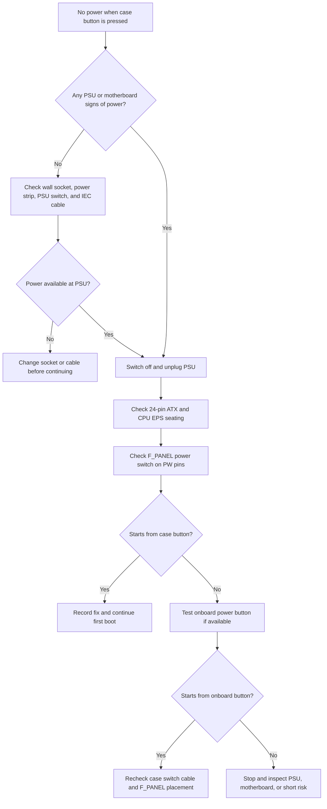
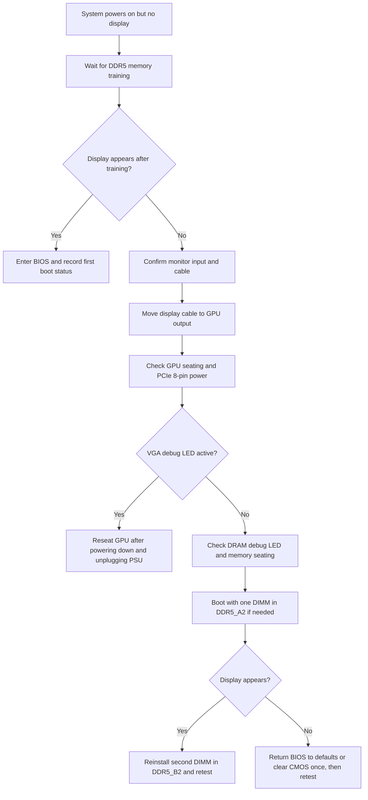
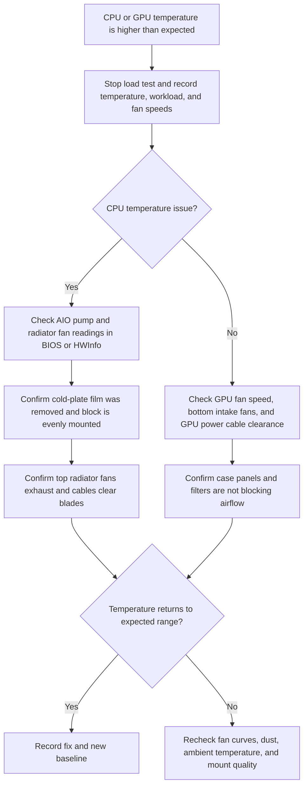
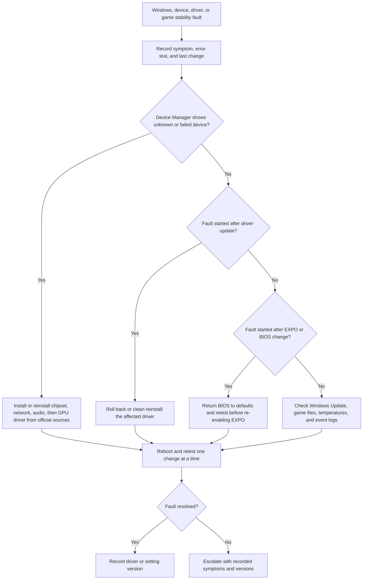

# Troubleshooting

Status: Verified Milestone 5 troubleshooting content. Last verified: 2026-07-13 14:09 BST.

## Introduction

This chapter gives structured checks for common build, boot, BIOS, Windows, driver, temperature, and performance problems.

## Purpose

Diagnose one fault at a time without randomly changing settings or disassembling working parts.

## Estimated Time

15 minutes to several hours depending on the fault.

## Difficulty

Moderate.

## Required Tools

- Motherboard manual.
- Flashlight.
- Spare USB drive if BIOS recovery is needed.
- Phone or laptop for support pages.
- Notes file for recording symptoms and changes.

## Warnings

- Change one variable at a time.
- Switch off and unplug the PSU before reseating hardware.
- Do not clear CMOS repeatedly without recording what changed.
- Do not keep power-cycling if there is a burning smell, smoke, liquid, or visible damage.
- Do not assume a failed boot is a failed component until basic power and seating checks are complete.

## Step-by-Step Instructions

1. Record the exact symptom.
2. Record what changed immediately before the symptom appeared.
3. Check motherboard debug LEDs or codes if available.
4. Check external basics: wall power, PSU switch, monitor input, display cable, keyboard, and USB installer.
5. Check internal power:
    - 24-pin ATX seated.
    - CPU EPS seated.
    - GPU PCIe power seated.
    - Front-panel power switch connected.
6. Check seating:
    - RAM fully latched in `A2` and `B2`.
    - GPU fully latched in primary PCIe slot.
    - SSD secured in M.2 slot.
7. Return BIOS to optimized defaults if the fault began after settings changes.
8. Disable EXPO if the fault is memory-training or boot-loop related.
9. Boot with minimum required hardware if needed: CPU, cooler, one RAM module, GPU, SSD, keyboard, and display.
10. Reintroduce hardware or settings one at a time.

## Decision Trees

Use these decision trees to isolate common faults. They are intentionally conservative: power down and unplug the PSU before reseating internal hardware.

### No Power

Source: [troubleshooting-no-power.mmd](assets/diagrams/mermaid/troubleshooting-no-power.mmd)

### Powers On, No Display

Source: [troubleshooting-no-display.mmd](assets/diagrams/mermaid/troubleshooting-no-display.mmd)

### High Temperature

Source: [troubleshooting-high-temperature.mmd](assets/diagrams/mermaid/troubleshooting-high-temperature.mmd)

### Windows, Driver, Or Game Fault

Source: [troubleshooting-windows-driver.mmd](assets/diagrams/mermaid/troubleshooting-windows-driver.mmd)

## Common Faults

| Symptom | Likely area | First checks |
| --- | --- | --- |
| No power | PSU, front-panel connector, wall power | PSU switch, wall socket, 24-pin, front-panel power switch pins. |
| Powers on, no display | GPU, memory training, monitor path | Display cable in GPU, GPU power, wait for DDR5 training, RAM seating. |
| Boot loop after EXPO | Memory profile | Clear CMOS, boot defaults, confirm approved kit and slots. |
| SSD missing | M.2 installation | Slot seating, M.2 latch/screw, BIOS storage page. |
| High CPU temperature | Cooler | Pump/fan header, cold-plate film, mounting pressure, radiator fans. |
| Front USB not working | Front-panel cable | USB header seating, bent pins, Windows driver status. |
| GPU driver crash | GPU driver or power | AMD driver version, PCIe power cable, Windows Update, default GPU tuning. |
| Random restart under load | Power, temperature, driver, or memory stability | Check temperatures, PSU/GPU power seating, Event Viewer, and EXPO stability. |
| Front audio missing | Header or Windows audio device | Confirm `F_AUDIO` seating, Realtek driver state, and selected output device. |
| Network missing after Windows install | Driver or adapter state | Install official motherboard network driver, then Windows Update. |

## Verification Checklist

- [ ] Symptom and last change are recorded.
- [ ] Power cables are checked.
- [ ] RAM and GPU seating are checked.
- [ ] BIOS defaults are tested if settings changed.
- [ ] EXPO is disabled during memory fault isolation.
- [ ] Only one change is tested at a time.
- [ ] Final fix is recorded.

## Common Mistakes

- Changing BIOS, drivers, and cables at the same time.
- Reseating the CPU before checking power cables.
- Forgetting that first DDR5 training can take time.
- Blaming Windows before checking Device Manager.
- Leaving the successful fix undocumented.

## Expected Result

Faults are isolated methodically, corrected, and documented without introducing additional uncertainty.

## Sources Reviewed

- [Gigabyte B850 AORUS Elite WiFi7 user manual 1101](https://download.gigabyte.com/FileList/Manual/mb_manual_b850-aorus-elite-wf7_1101_e.pdf)
- [Microsoft Windows 11 recovery options](https://support.microsoft.com/windows/recovery-options-in-windows-31ce2444-7de3-818c-d626-e3b5a3024da5)
- [AMD drivers and support](https://www.amd.com/en/support/download/drivers.html)

## Next Chapter

Continue to [Maintenance](25-maintenance.md).
